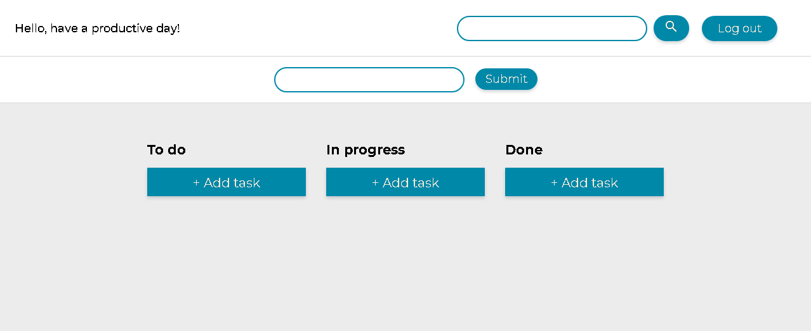
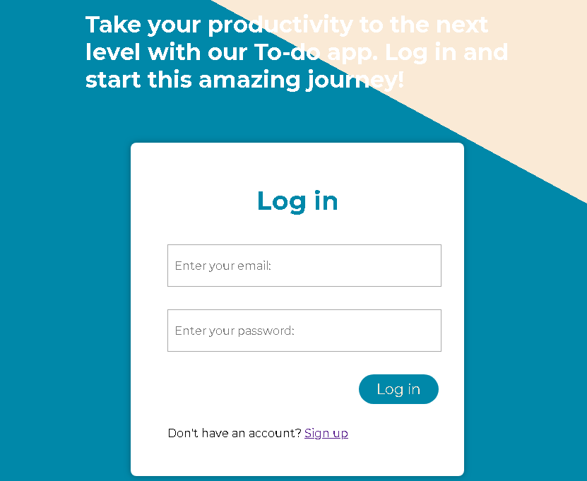

# To Do Application
Node based application for creating, editing and displaying tasks

**Table of Contents**

  * [Deployment](#deployment)
  * [Technologies](#technologies)
  * [Functionalities](#functionalities)
  * [Sample pictures](#pictures)
  * [Team](#team)

## Deployment
Deployment to Heroku planned in the future, stay tuned.

## Technologies
JavaScript, Express, Node.js, MongoDB

## Functionalities
Based on Trello and Asana, this app allows users to create, edit and delete tasks. 
Each task contains the author's name and inner text with its status of To do, In progress or Done
being indicated by a color scheme. Only registered and logged in users can interact with tasks.

## Sample pictures
Tasks board             |  Login 
:-------------------------:|:-------------------------:
  |  

## Team
* [Anna-Jasica](https://github.com/Anna-Jasica)
* [neternefer](https://github.com/neternefer)
* [Jadwiga92](https://github.com/Jadwiga92)
* [OrianaKJ](https://github.com/OrianaKJ)
* [karolsz15](https://github.com/karolsz15)

